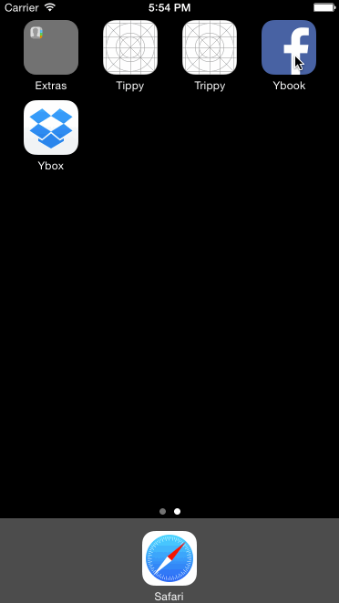

# Ybook

Prototype of a Facebook app, which is building on what I did for the previous week's exercise.  I hooked up the login sequence in class, and then it took another hour to finish the logout confirmation, news feed fade-in animation, pull to refresh and logging on by pressing the Go button. 

